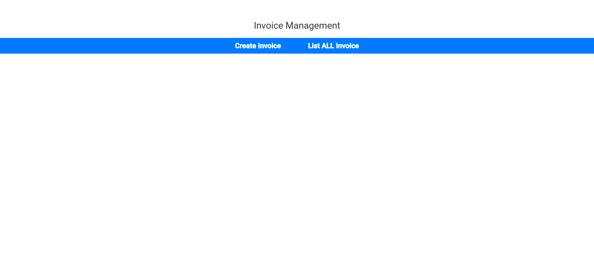
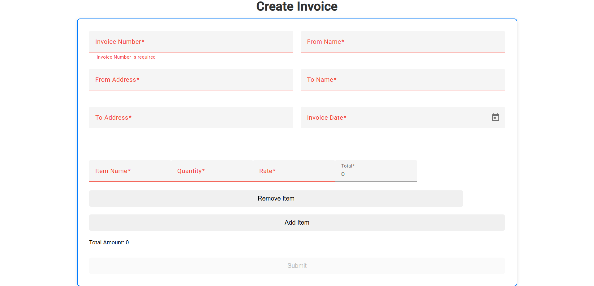

# Invoice Management System - Frontend (Angular)

This is the frontend part of the Invoice Management System built with **Angular**.

## Features

- Create and manage invoices
- View the list of invoices
- Responsive design

## Screenshots







### Invoice Creation

""

## Setup

1. Clone the repository:
   ```bash
   git clone https://github.com/Aakash-Bhoi730/invoice-frontend.git
   cd invoice-frontend
   ```
